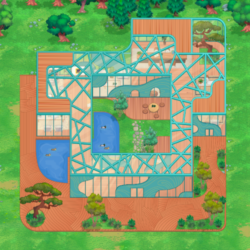

# 100 Roads Design

100 Roads has been designing and innovating in the education space since 2016. Our founder, Catherine Fraise, first designed a physical campus at Workspace Education in Bethel CT.

When lockdowns raised new problems, Catherine moved into developing online learning environments.

100 Roads Design is located in McLeod, Montana and our virtual campuses are created by a global team of digital architects, creatives, community builders and educators.

Learn more about us at https://100roadsdesign.com. 

# About the map

The map is called Learning Lab and ..... sddsvdfevg 